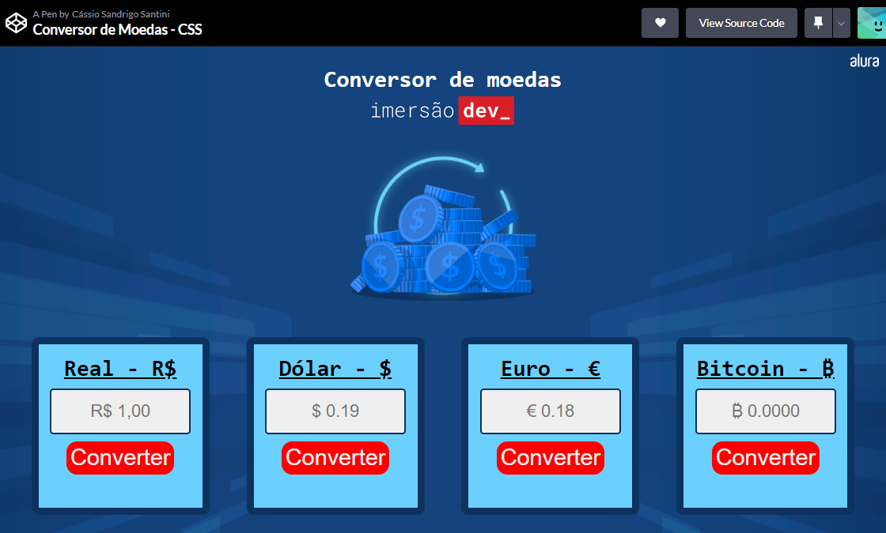

# Imersão Dev 6ª Edição
Repositório para guardar os projetos da Imersão Dev 6ª Edição, da Alura.

| :placard: Vitrine.Dev |     |
| -------------  | --- |
| :sparkles: Nome        | **Imersão Dev 6ª Edição**
| :label: Tecnologias | HTML, CSS, JavaScript
| :rocket: URL         | https://codepen.io/Enyus/full/QWBzLRx

<!-- Inserir imagem com a #vitrinedev ao final do link -->

## Detalhes do Projeto
Minha intenção inicial era fazer nas aulas mais do que o esperado, especialmente para mostrar pra mim mesmo a evolução nestes dois anos de estudo desde a Imersão Dev 2021. Infelizmente, porém, não tive tempo para fazer todas as aulas como gostaria, mas fiquei bastante orgulhoso do Jogo da Forca.

## Aula 1 - Conversor de Moedas
O objetivo desta aula era apresentar os conceitos básicos de JavaScript para os iniciantes, usando operadores matemáticos comuns.

Decidi consumir a <a href="https://docs.awesomeapi.com.br/api-de-moedas"> API de Economia da Awesome API</a> para usar as cotações reais oferecidas pelo serviço e a função nativa do Javascript de formatação de moedas <a href="https://developer.mozilla.org/pt-BR/docs/Web/JavaScript/Reference/Global_Objects/Intl/NumberFormat">``Intl.NumberFormat(params)``</a>.

<a href="https://codepen.io/Enyus/pen/dyjgoOM">Veja no CodePen.</a>

## Aula 2 - Mentalista
A idéia inicial da aula era criar um jogo de adivinhação em que o usuário deveria tentar descobrir um número gerado automaticamente pela função ``Math.Random()`` usando Prompts e Alerts.

Resolvi consumir a <a href="https://api.dicionario-aberto.net/index.html">API Dicionário aberto</a> para criar uma palavra aleatoriamente para que o usuário pudesse chutar letra a letra e, sempre que errasse, a forca iria se completando. Usou-se, além do fetch para consumir a API, métodos de array, métodos de alteração do DOM e eventos.

 
<a href="https://codepen.io/Enyus/pen/QWBzLRx">Veja no CodePen.</a>
